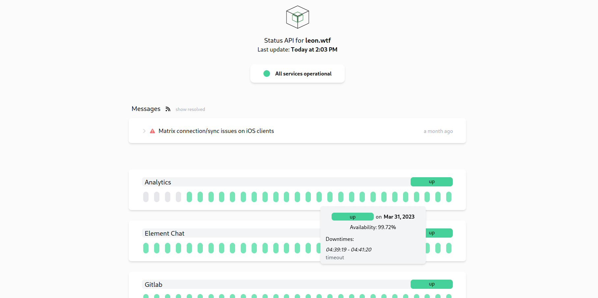

# Status API

The Status API is a dashboard to log the uptime of server services. Unlike other uptime tools, the services are checked at the application level - and not only via TCP/UDP. This allows for more protocol-related information like HTTP status code or the number of connected users on a Minecraft server.

Additionally, the dashboard can display status messages like planned maintenance or other defects. The Status API also generates an Atom feed from them, so service users always stay up to date.

The public dashboard is kept simple and is able to show the uptime-timeline for the last 30-days -- or less when on mobile to preserve some space. The API itself ist CORS-compliant to be used from other web applications.

A **public example used in production** can be seen here: https://status.leon.wtf

## Supported protocols

The so called "Procotol Checkers" are modular pieces of code that can be attached to the Status API to support additional protocols to check your services with. See below for the current list of supported protocols.

Protocols are implemented as Protocol Checker Modules in `server/protocols/checkers/`. They define, which protocols are supported to be used to check services. Curently, the following Protocol Checkers are implemented:
- **HTTP(S)**
    - Optionally with basic authentication
    - Can expect status codes (or status code ranges), HTML content or response headers
- **SMTP**
    - Supports StartTLS, implicit and explicit TLS
- **Minecraft**
    - Supports displaying the number of connected users
- **Teamspeak (over SSH query)**
    - Checks the Teamspeak server without requiring authentication data!

Each protocol can have a deviating test URL and a friendly URL this will be displayed on the dashboard.

By default, all services are checked in a 120 seconds interval.

## Supported notifiers

The Status API can inform you if one of your services goes down. Just list the Protocol Checkers, the so-called Notifiers are modular, too. Currently, the following Notifiers are supported:
- **Log** (Default Notifier, just logs to STDOUT)
- **[Gotify Server](https://gotify.net/)**
- **Telegram**
- **E-Mail** (coming soon, see #2)

## Configuration

The Status API is configured via a single `config.json` file. Visit the [repository wiki](https://git.leon.wtf/leon/status-api/-/wikis/Configuration) on how to do it.

## Tech stack

The frontend was built with `React 18.3.1` using `node v22.9.0`. For styling, Tailwind CSS was used.

The server (API backend) was built using `go 1.23.3`.
